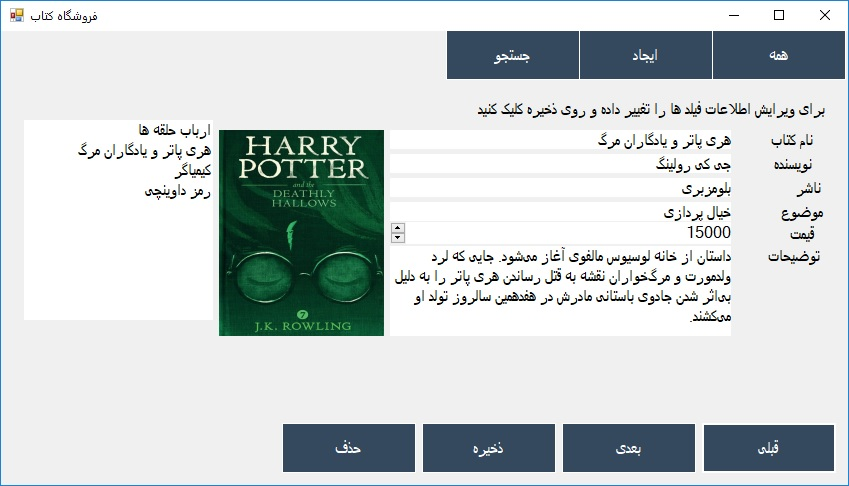

# Bookshop
This is a simple project to store books data for a small shop.
Written with C# Windows Forms Application and SQLite

#### Build and Run
1. You need to install [DotNet Core SDK](https://dotnet.microsoft.com/download) to build the project.
2. `git clone https://github.com/ainyava/bookshop`
3. `cd bookshop`
4. `dotnet run`

In `bin/debug` directory is a `bookshop.db` for database and it has some Persian sample data.

#### Project
This was a simple project that I wrote for my basic programming class
with SQLite Select,Insert,Update and Delete commands.
##### Screenshot

Good Luck :)